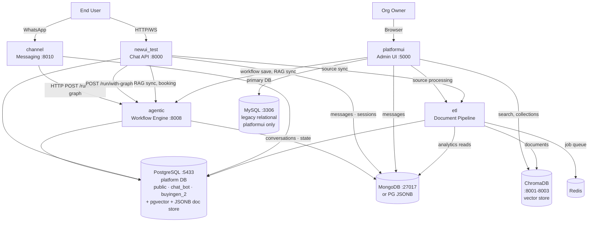

# Architecture Overview

The Agentic Platform is a multi-service system delivering AI-powered chatbot applications over HTTP.

The platform supports **gradual migration** from a legacy stack (MySQL + MongoDB + ChromaDB) to a consolidated PostgreSQL stack (relational data + pgvector + JSONB doc store). Most services use a 3-priority env var chain (`DATABASE_URL` > `POSTGRES_*` > `MYSQL_*`) so the same code runs against either backend. Document and vector stores are similarly dual-backend, switchable per service via `DOC_STORE_BACKEND` and `VECTOR_STORE_BACKEND`.

## System topology

Services, databases, and external systems — all connections shown.

## Backend compatibility

Each storage category supports multiple backends, selected per service at runtime.

### Relational database

PostgreSQL is primary; MySQL is a legacy fallback in most services, and the primary DB for platformui.

| Backend | Env var priority | Used by |
|---|---|---|
| **PostgreSQL** | `DATABASE_URL` or `POSTGRES_HOST`/`POSTGRES_USER`/`POSTGRES_DB` | agentic, newui_test, channel, etl |
| **MySQL** | `MYSQL_HOST`/`MYSQL_USER`/`MYSQL_DB` (fallback when no PG vars) | platformui (primary), all others (legacy fallback) |

agentic, newui_test, channel, and etl resolve their DB URL via: `DATABASE_URL` → `POSTGRES_*` → `MYSQL_*`. platformui is the exception — it uses `pymysql.connect()` directly against `MYSQL_*` vars and has no PostgreSQL path yet.

### Document store

MongoDB is the default; PostgreSQL JSONB tables (`doc_*`) provide an alternative within the same PG database.

| Backend | Env var | What it stores |
|---|---|---|
| **MongoDB** | `DOC_STORE_BACKEND=mongodb` (default) | Conversations, agent traces, session state, analytics |
| **PostgreSQL JSONB** | `DOC_STORE_BACKEND=postgresql` | Same data in `doc_*` tables (JSONB columns) |

agentic, newui_test, and etl support both. platformui uses MongoDB directly (no abstraction). channel does not use a doc store.

### Vector store

pgvector is the default; ChromaDB is a fallback. Services use an abstraction layer except platformui which calls ChromaDB directly.

| Backend | Env var | Used by |
|---|---|---|
| **pgvector** | `VECTOR_STORE_BACKEND=pgvector` (default) | agentic, newui_test, etl (through abstraction layer) |
| **ChromaDB** | `VECTOR_STORE_BACKEND=chroma` | agentic, newui_test, etl (fallback); platformui (direct, not abstracted) |

platformui still connects to ChromaDB directly for search and collection management — it has not been migrated to the `VectorStoreManager` abstraction used by the other services.

## Service responsibilities

What each microservice owns and how it contributes to the platform.

- **[[services/newui-test]]** — Entry point for chat. Receives user messages, resolves org/graph config from PostgreSQL (or MySQL fallback), forwards to agentic, persists turns (MongoDB or PG JSONB), returns response via HTTP + optional WebSocket. Also triggers RAG sync and booking operations against agentic and ETL.
- **[[services/agentic]]** — The AI brain. Runs LangGraph workflows. Uses PostgreSQL (or MySQL fallback) for org/booking/workflow data, pgvector (default) or ChromaDB for vector search, MongoDB or PG JSONB for conversation memory. Serves workflow CRUD, session management, booking webhooks, and Gmail polling.
- **[[services/platformui]]** — Admin dashboard. Runs on **MySQL** as its primary relational DB (via `pymysql`, no PostgreSQL path yet). Connects to ChromaDB directly for search and collection management. Uses MongoDB directly for message storage. Also calls agentic, ETL, and external reporting/recommender services.
- **[[services/channel]]** — WhatsApp bridge. Receives webhooks, normalizes messages, forwards directly to agentic (bypassing newui_test). Uses PostgreSQL (or MySQL fallback) for conversation persistence. No MongoDB or vector store dependency.
- **[[services/etl]]** — Document ingestion pipeline. Writes to pgvector (default) or ChromaDB for vectors, and to the `buyingen_2` PostgreSQL schema (or MySQL fallback) for source metadata. Relational DB also resolved via the 3-priority chain. Uses Redis for job queues.

## Data flow

Chat: User → newui_test → agentic (LangGraph) → newui_test → User. WhatsApp takes a shortcut: User → channel → agentic → channel → User (no newui_test involved).

The agentic service orchestrates all LLM calls and tool invocations. See [[concepts/supervisor]] for routing and [[concepts/graph-engine]] for graph construction.

## Deployment

Each service in its own Docker container. PostgreSQL :5433 with pgvector extension. MySQL :3306 for platformui. ChromaDB :8001-8003. MongoDB :27017. Redis for ETL job queues.

`DATABASE_URL` or `POSTGRES_*`/`MYSQL_*` selects the relational backend. `VECTOR_STORE_BACKEND` (default: `pgvector`) and `DOC_STORE_BACKEND` (default: `mongodb`) control vector and document store selection per service.
