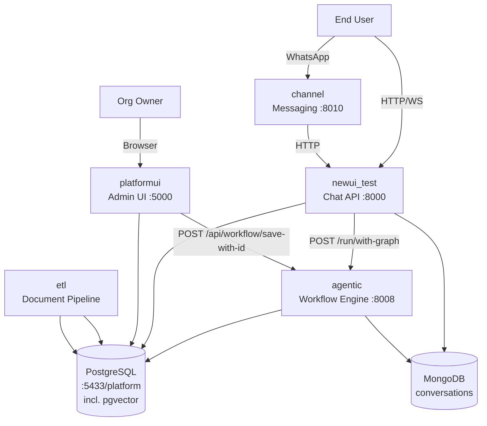

# Architecture Overview

The Agentic Platform is a multi-service system that delivers AI-powered chatbot applications. It follows a layered architecture where services communicate over HTTP, sharing a single PostgreSQL database and MongoDB for conversation storage.

## System topology

Mermaid diagram showing how services, databases, and external systems connect.

## Service responsibilities

What each microservice owns and how it contributes to the platform.

- **[[services/newui-test]]** — Entry point for chat. Receives user messages, resolves org/graph configuration from PostgreSQL, forwards to agentic, saves turns to MongoDB, returns response via HTTP + optional WebSocket push.
- **[[services/agentic]]** — The AI brain. Runs LangGraph workflows: intent classification → routing to booking/RAG/general subgraphs → answer synthesis. Also serves workflow CRUD, session management, and booking webhook endpoints.
- **[[services/platformui]]** — Admin dashboard for organization owners. Handles app creation, booking organization setup, service/resource configuration, and reporting. Uses Flask with SQLAlchemy.
- **[[services/channel]]** — WhatsApp business integration. Receives webhooks from Meta/Chakra, normalizes them, and forwards to newui_test. Supports multiple providers via a registry pattern.
- **[[services/etl]]** — Document ingestion pipeline. Processes files (PDF, DOCX, etc.), chunks them, generates embeddings, and populates ChromaDB collections and the buyingen_2 schema.

## Data flow

The primary chat flow is: User → newui_test → agentic (LangGraph) → newui_test → User. The agentic service orchestrates all LLM calls and tool invocations. See [[concepts/supervisor]] for the routing logic and [[concepts/graph-engine]] for how graphs are constructed.

## Deployment

Each service runs in its own Docker container with uvicorn (hot-reload in dev). PostgreSQL runs on port 5433 with the `pgvector` extension for vector storage. MongoDB runs on default port 27017. ChromaDB is available as a fallback vector store.
